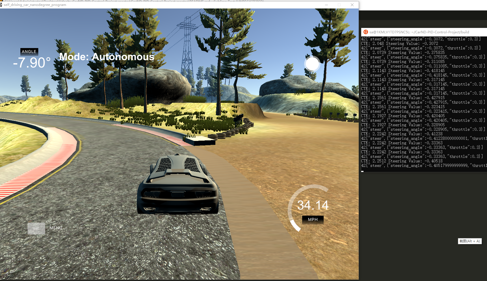

# CarND-Controls-PID
Udacity Self-Driving Car Engineer Nanodegree Program, Term 2 ,Project 4 - Controls PID

## Project Basics
This project is write by C++.

I used Controls PID to minimize the distance to this reference trajectory.

This project involves the Term 2 Simulator.

## Parameters

P - proportional gain

I init Kp=0.15. I tried some other parameters, I found this one will get a smooth result.

D - differential gain

I init Kd=2.5.  

I - integral gain

I init Kp=0. Because used the Simulator, so Kp is really small, I tried  set Kp=0.0001,but it didn't work well.

## Basic Build Instructions

1. Clone this repo.
2. Make a build directory: `mkdir build && cd build`
3. Compile: `cmake .. && make`
4. Run it: `./pid`. 

## Result

